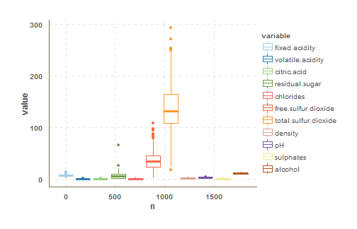

## The "Business Decision"

We want to know if we can predict the quality of wine based on its chemical attributes. The goal of the project is to identify key attributes or a more complex decision making process that will help wine amateurs identify good quality wine.

## The Data

For the purpose of this project we identified a multivariate data set from the UCI Machine Learning Repository, which is is a collection of databases, domain theories, and data generators that are used by the machine learning community for the empirical analysis of machine learning algorithms (<i> P. Cortez, A. Cerdeira, F. Almeida, T. Matos and J. Reis. Modeling wine preferences by data mining from physicochemical properties. In Decision Support Systems, Elsevier, 47(4):547-553, 2009.</i>). The data set that we will be using is related to white vinho verde wine samples, from the north of Portugal.

We will be using the full data set that has the following 12 attributes:

Attribute # | Description
:------|:-----------
1  | Fixed acidity
2  | Volatile acidity
3  | Citric acid
4  | Residual sugar
5  | Chlorides
6  | Free sulfur dioxide
7  | Total sulfur dioxide
8  | Density
9  | pH
10 | Sulphates
11 | Alcohol
12 | Quality - the dependant variable (score between 0 and 10)

Let's have a look at the data for a few wines to get a sense of it. This is how the first 10 out of the total of 4898 wines look:


|                     |     01|     02|    03|     04|     05|    06|     07|     08|     09|     10|
|:--------------------|------:|------:|-----:|------:|------:|-----:|------:|------:|------:|------:|
|fixed.acidity        |   7.00|   6.30|  8.10|   7.20|   7.20|  8.10|   6.20|   7.00|   6.30|   8.10|
|volatile.acidity     |   0.27|   0.30|  0.28|   0.23|   0.23|  0.28|   0.32|   0.27|   0.30|   0.22|
|citric.acid          |   0.36|   0.34|  0.40|   0.32|   0.32|  0.40|   0.16|   0.36|   0.34|   0.43|
|residual.sugar       |  20.70|   1.60|  6.90|   8.50|   8.50|  6.90|   7.00|  20.70|   1.60|   1.50|
|chlorides            |   0.04|   0.05|  0.05|   0.06|   0.06|  0.05|   0.04|   0.04|   0.05|   0.04|
|free.sulfur.dioxide  |  45.00|  14.00| 30.00|  47.00|  47.00| 30.00|  30.00|  45.00|  14.00|  28.00|
|total.sulfur.dioxide | 170.00| 132.00| 97.00| 186.00| 186.00| 97.00| 136.00| 170.00| 132.00| 129.00|
|density              |   1.00|   0.99|  1.00|   1.00|   1.00|  1.00|   0.99|   1.00|   0.99|   0.99|
|pH                   |   3.00|   3.30|  3.26|   3.19|   3.19|  3.26|   3.18|   3.00|   3.30|   3.22|
|sulphates            |   0.45|   0.49|  0.44|   0.40|   0.40|  0.44|   0.47|   0.45|   0.49|   0.45|
|alcohol              |   8.80|   9.50| 10.10|   9.90|   9.90| 10.10|   9.60|   8.80|   9.50|  11.00|
|quality              |   6.00|   6.00|  6.00|   6.00|   6.00|  6.00|   6.00|   6.00|   6.00|   6.00|

And now let's zoom out really far and have a look at histograms of all the attributes:


## The analysis process

We chose to design our analysis process based on the 6-step process provided in class.

### Classification in about 6 steps

1. Create an estimation sample and two validation samples by splitting the data into three groups. Steps 2-5 below will then be performed only on the estimation and the first validation data.
2.  Set up the dependent variable (as a categorical 0-1 variable; multi-class classification is also feasible, and similar, but we do not explore it in this note).
3. Make a preliminary assessment of the relative importance of the explanatory variables using visualization tools and simple descriptive statistics. 
4.  Estimate the classification model using the estimation data, and interpret the results.
5. Assess the accuracy of classification in the first validation sample, possibly repeating steps 2-5 a few times in different ways to increase performance.
6. Finally, assess the accuracy of classification in the second validation sample.  You should eventually use/report all relevant performance measures/plots on this second validation sample only.

So let's follow these steps.

### Step 1: Split the data

Before performing anything else we must split the dataset into 3 sets: the estimation, validation and test set. Doing this early ensures that we do not contaminate the test data.

The estimation data and the first validation data are used during steps 2-5 (with a few iterations of these steps), while the second validation data is only used once at the very end before making final business decisions based on the analysis.

We have chosen to do the split ca. 80% estimation, 10% validation, and 10% test data as we had 4898 samples to choose from.


### Step 2: Choose and setup the dependent variable
We will be using quality as the multi-category dependent variable. Let's have a look again at the data to see if there are some categories that we want to create other than the 1-10 scale.


It is pretty clear that 6 is the deciding value for the wine quality - effectively splitting the dataset between appauling, normal and good wine. Therefore, let's setup 3 categories to reflect this:


Classification | Quality | # Occurences in estimation data | # Occurences in validation data | # Occurences in test data
:------|:-----------|:----------|:-----------|:----------
Bad  | 5 or less | 0 (0%) | 0 (0%) | 0 (0%)
Normal  | 6 | 0 (0%) | 0 (0%) | 0 (0%)
Good  | 7 or greater | 845 (22%) | 115 (23%) | 100 (20%)


### Step 3: Simple Analysis

Lets start the analysis with checking some simple statistical information about the data subsets.

**Bad wine**


|                     |   min| 25 percent| median|   mean| 75 percent|    max|   std|
|:--------------------|-----:|----------:|------:|------:|----------:|------:|-----:|
|fixed.acidity        |  4.20|       6.40|   6.80|   6.97|       7.50|  10.30|  0.87|
|volatile.acidity     |  0.11|       0.24|   0.29|   0.31|       0.35|   1.10|  0.11|
|citric.acid          |  0.00|       0.24|   0.32|   0.34|       0.42|   1.00|  0.15|
|residual.sugar       |  0.60|       1.70|   6.70|   7.05|      11.00|  22.60|  5.24|
|chlorides            |  0.01|       0.04|   0.05|   0.05|       0.05|   0.35|  0.03|
|free.sulfur.dioxide  |  2.00|      21.00|  34.00|  35.57|      49.00| 289.00| 20.37|
|total.sulfur.dioxide | 19.00|     117.00| 151.00| 149.71|     182.00| 440.00| 46.94|
|density              |  0.99|       0.99|   1.00|   1.00|       1.00|   1.00|  0.00|
|pH                   |  2.79|       3.08|   3.16|   3.17|       3.24|   3.79|  0.14|
|sulphates            |  0.25|       0.41|   0.47|   0.48|       0.53|   0.88|  0.10|
|alcohol              |  8.00|       9.20|   9.60|   9.83|      10.40|  13.40|  0.86|
|quality              |  3.00|       5.00|   5.00|   4.87|       5.00|   5.00|  0.37|

**Normal wine**


|                     |   min| 25 percent| median|   mean| 75 percent|    max|   std|
|:--------------------|-----:|----------:|------:|------:|----------:|------:|-----:|
|fixed.acidity        |  3.80|       6.30|   6.80|   6.83|       7.30|  14.20|  0.85|
|volatile.acidity     |  0.08|       0.20|   0.25|   0.26|       0.30|   0.96|  0.09|
|citric.acid          |  0.00|       0.27|   0.32|   0.34|       0.38|   1.66|  0.12|
|residual.sugar       |  0.70|       1.70|   5.30|   6.43|       9.90|  65.80|  5.16|
|chlorides            |  0.02|       0.04|   0.04|   0.04|       0.05|   0.20|  0.02|
|free.sulfur.dioxide  |  3.00|      24.00|  34.00|  35.82|      46.00| 108.00| 15.73|
|total.sulfur.dioxide | 18.00|     108.00| 132.00| 137.15|     164.00| 294.00| 41.41|
|density              |  0.99|       0.99|   0.99|   0.99|       1.00|   1.04|  0.00|
|pH                   |  2.72|       3.08|   3.18|   3.19|       3.28|   3.81|  0.15|
|sulphates            |  0.23|       0.41|   0.48|   0.49|       0.55|   1.06|  0.11|
|alcohol              |  8.50|       9.60|  10.45|  10.58|      11.40|  14.00|  1.15|
|quality              |  6.00|       6.00|   6.00|   6.00|       6.00|   6.00|  0.00|


**Good wine**


|                     |   min| 25 percent| median|   mean| 75 percent|    max|   std|
|:--------------------|-----:|----------:|------:|------:|----------:|------:|-----:|
|fixed.acidity        |  3.90|       6.20|   6.70|   6.72|       7.20|   9.20|  0.77|
|volatile.acidity     |  0.08|       0.19|   0.25|   0.26|       0.32|   0.76|  0.09|
|citric.acid          |  0.01|       0.28|   0.32|   0.33|       0.36|   0.74|  0.08|
|residual.sugar       |  0.80|       1.70|   3.60|   5.12|       7.30|  19.25|  4.25|
|chlorides            |  0.01|       0.03|   0.04|   0.04|       0.04|   0.14|  0.01|
|free.sulfur.dioxide  |  5.00|      25.00|  33.00|  34.46|      41.00| 108.00| 13.67|
|total.sulfur.dioxide | 34.00|     100.00| 122.00| 124.73|     145.00| 229.00| 32.67|
|density              |  0.99|       0.99|   0.99|   0.99|       0.99|   1.00|  0.00|
|pH                   |  2.90|       3.10|   3.20|   3.21|       3.32|   3.82|  0.16|
|sulphates            |  0.25|       0.40|   0.48|   0.50|       0.58|   1.08|  0.13|
|alcohol              |  8.50|      10.70|  11.50|  11.44|      12.40|  14.20|  1.25|
|quality              |  7.00|       7.00|   7.00|   7.18|       7.00|   9.00|  0.39|


Now let's do some simple box plots based on the above data as they may help usassess the discriminatory power of the independent variables.

**Bad wine**


**Normal wine**


**Good wine**




### Step 4: Classification and Interpretation

It is time now to run a the classification algorithm on the data set. We have chosen to use the random forest tree algorithm for this.


There are a few basic parameters that can be set when we run the randomForest algorithm. So let's start with looking at the error rates vs the number of tress in the random forest.


Lets also look at some of the observations and see how the model predicted the quality of the wine.


| average| good| poor|predicted.value |actual.value |
|-------:|----:|----:|:---------------|:------------|
|    0.68| 0.23| 0.09|average         |poor         |
|    0.41| 0.32| 0.27|average         |good         |
|    0.53| 0.02| 0.46|average         |average      |
|    0.54| 0.05| 0.41|average         |average      |
|    0.05| 0.02| 0.93|poor            |poor         |
|    0.17| 0.01| 0.82|poor            |average      |
|    0.62| 0.20| 0.18|average         |average      |
|    0.44| 0.00| 0.56|poor            |poor         |
|    0.65| 0.14| 0.21|average         |average      |
|    0.44| 0.31| 0.25|average         |good         |


```
## Confusion Matrix and Statistics
## 
##           Reference
## Prediction average good poor
##    average     154   38   48
##    good         17   72    2
##    poor         42    5  112
## 
## Overall Statistics
##                                           
##                Accuracy : 0.6898          
##                  95% CI : (0.6468, 0.7305)
##     No Information Rate : 0.4347          
##     P-Value [Acc > NIR] : < 2e-16         
##                                           
##                   Kappa : 0.5124          
##  Mcnemar's Test P-Value : 0.02126         
## 
## Statistics by Class:
## 
##                      Class: average Class: good Class: poor
## Sensitivity                  0.7230      0.6261      0.6914
## Specificity                  0.6895      0.9493      0.8567
## Pos Pred Value               0.6417      0.7912      0.7044
## Neg Pred Value               0.7640      0.8922      0.8489
## Prevalence                   0.4347      0.2347      0.3306
## Detection Rate               0.3143      0.1469      0.2286
## Detection Prevalence         0.4898      0.1857      0.3245
## Balanced Accuracy            0.7063      0.7877      0.7740
```


