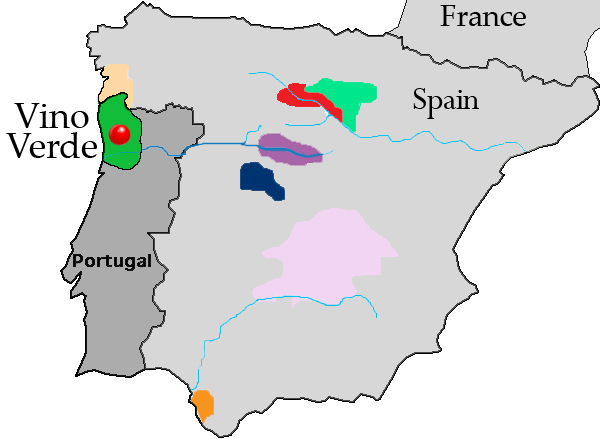

```{r setup, include=FALSE}
knitr::opts_chunk$set(echo = TRUE)


#TODO: randomForest on quality not taste
#TODO: supervised random forest where upward mistakes are free and downward mistakes are proportional to the 2nd power of the distance between the two scores  


#Setup document constants

# Setup key filenames and directory paths
local_directory = "."
datafile_name = "winequality-white"

#Load external libraries
source(paste(local_directory,"/AnalyticsLibraries/library.R", sep="/"))
if (require(randomForest)==FALSE){install.packages("randomForest")}; library(randomForest)
if (require(caret)==FALSE){install.packages("caret")}; library(caret)
if (require(e1071)==FALSE){install.packages("e1071")}; library(e1071)

#Package options
ggthemr('fresh')  # ggplot theme

# The maximum number of observations to show in the report and slides 
max_data_report = 10

# Percentages of data used for estimation
estimation_data_percent = 80
validation_data_percent = 10
test_data_percent = 100 - estimation_data_percent - validation_data_percent

# Let's finally read in the data file
ProjectData <- read.csv(paste(paste(local_directory, "data", sep="/"), paste(datafile_name,"csv", sep="."), sep = "/"), sep=";") # this contains only the matrix ProjectData
ProjectData = data.frame(ProjectData)

```


## The "Business Decision"



Can we help winemakers and wine drinkers identify faults in wine by analyzing its chemical properties? Using chemical properties of wine, we want to predict bad quality or faulty wine. As a bonus we will check if we can more generally predict the quality of the wine based on its chemical attributes.
<br clear="left"/>

## The Data

For the purpose of this project we identified a multivariate data set from the UCI Machine Learning Repository, which is is a collection of databases, domain theories, and data generators that are used by the machine learning community for the empirical analysis of machine learning algorithms (<i> P. Cortez, A. Cerdeira, F. Almeida, T. Matos and J. Reis. Modeling wine preferences by data mining from physicochemical properties. In Decision Support Systems, Elsevier, 47(4):547-553, 2009.</i>). The data set that we will be using is related to white vinho verde wine samples.

We will be using the full data set that has the following 12 attributes:

Attribute # | Description
:------|:-----------
1  | Fixed acidity
2  | Volatile acidity
3  | Citric acid
4  | Residual sugar
5  | Chlorides
6  | Free sulfur dioxide
7  | Total sulfur dioxide
8  | Density
9  | pH
10 | Sulphates
11 | Alcohol
12 | Quality (score between 0 and 10)


<i> A quick chemistry interlude to help better understand the data set... 

Fixed and volatile acidity are considered separately as they have important impacts on wine quality. Acids are important constituents of wine and contribute greatly to taste.  Wines lacking in acid are often described as "flat," lacking in wine's characteristic tartness.  Chemically, acids influence titrable acidity which impacts taste, pH, color, stability to oxidation, and ability to age. Volatile acidity, or </i> vinegar taint, <i> can be contributed by many wine spoilage yeasts and bacteria. Although too high a concentration is sure to leave an undesirable, 'vinegar' tasting wine, some wine's acetic acid levels are developed to create a more 'complex', desirable taste.

Free sulfur dioxide and total sulfur dioxide are also considered separately due to their chemical contributions to wine quality and taste. Sulfur dioxide (SO2) is important in the winemaking process as it aids in preventing microbial growth and the oxidation of wine. Generally speaking, total SO2 should be kept below 110 ppm for table wines like vinho verde because, at higher levels, the wine can acquire off-flavors.  Free SO2 is regarded as most important in wine production as it has the potent antioxidant and antimicrobial properties. </i>

Let's have a look at the data for a few wines to get a sense of it. This is how the first `r min(max_data_report, nrow(ProjectData))` out of the total of `r nrow(ProjectData)` wines look:

```{r echo=FALSE, message=FALSE, prompt=FALSE, results='asis'}
knitr::kable({
  df <- t(head(round(ProjectData[,],2), max_data_report))
  colnames(df) <- sprintf("%02d", 1:ncol(df))
  df
})
```

All the data is numeric - that's fantastic! Let's zoom out to have a look at histograms of all the attributes:

```{r echo=FALSE, message=FALSE, prompt=FALSE} 
par(mfrow = c(3,4))

barplot(table(ProjectData[,"fixed.acidity"]), main = "Fixed acidity")
barplot(table(ProjectData[,"volatile.acidity"]), main = "Volatile acidicity")
barplot(table(ProjectData[,"citric.acid"]), main ="Citric acid")
barplot(table(ProjectData[,"residual.sugar"]), main ="Residual sugar")
barplot(table(ProjectData[,"chlorides"]), main = "Chlorides")
barplot(table(ProjectData[,"free.sulfur.dioxide"]), main = "Free sulfur dioxide")
barplot(table(ProjectData[,"total.sulfur.dioxide"]), main = "Total sulfur dioxide")
barplot(table(ProjectData[,"density"]), main = "Density")
barplot(table(ProjectData[,"pH"]), main = "pH")
barplot(table(ProjectData[,"sulphates"]), main = "Sulphates")
barplot(table(ProjectData[,"alcohol"]), main = "Alcohol")
barplot(table(ProjectData[,"quality"]), main = "Quality")
```


## The analysis process

We chose to design our analysis process based on the 6-step process provided in class. However, instead of using logistic regression and classification and regression trees (CART) we decided that we would use an implementation of Breiman and Cutler's **Random Forests for Classification and Regression**. As a result we did not have to restrict ourselves to a binary dependent variable and changed **step 2**.
 

### Classification in about 6 steps

1. Create an estimation sample and two validation samples by splitting the data into three groups. Steps 2-5 below will then be performed only on the estimation and the first validation data.
2.  Set up the dependent variable.
3. Make a preliminary assessment of the relative importance of the explanatory variables using visualization tools and simple descriptive statistics. 
4.  Estimate the classification model using the estimation data, and interpret the results.
5. Assess the accuracy of classification in the first validation sample, possibly repeating steps 2-5 a few times in different ways to increase performance.
6. Finally, assess the accuracy of classification in the second validation sample.  You should eventually use/report all relevant performance measures/plots on this second validation sample only.

So let's follow these steps.

### Step 1: Split the data

Before performing anything else we must split the dataset into 3 sets: the estimation, validation and test set.

The estimation data and the first validation data are used during steps 2-5 (with a few iterations of these steps), while the second validation data is only used once at the very end before making final business decisions based on the analysis.

We have chosen to do the split ca. 80% estimation, 10% validation, and 10% test data as we had `r nrow(ProjectData)` samples to choose from.

```{r echo=FALSE, message=TRUE}
estimation_data_ids = sample.int(nrow(ProjectData),floor(estimation_data_percent*nrow(ProjectData)/100))
non_estimation_data = setdiff(1:nrow(ProjectData),estimation_data_ids)
validation_data_ids = non_estimation_data[sample.int(length(non_estimation_data), floor(validation_data_percent/(validation_data_percent+test_data_percent)*length(non_estimation_data)))]

test_data_ids = setdiff(1:nrow(ProjectData), union(estimation_data_ids,validation_data_ids))

EstimationData = ProjectData[estimation_data_ids,]
ValidationData = ProjectData[validation_data_ids,]
TestData = ProjectData[test_data_ids,]
```


### Step 2: Choose and setup the dependent variable

The main objective of our excercise is to help identify poor quality wine based on its chemical attributes. Poor quality, or faulty wines, have been defined in our dataset based on their **quality**:

```{r echo=FALSE, message=FALSE, prompt=FALSE}
barplot(table(ProjectData[,"quality"]), main = "Distribution of wine quality", xlab = "Quality", ylab = "Number of wines")
```

Wines with a quality below 5 are considered **faulty** - we **do not** want to **drink** these. This category is of primary interest in our study.

Interestingly, there is a clear distinction between the number of wines classified with quality 5 & 6 and the number of wines classified as over 6. Seeing this we decided to classify wines between **5 and 6** as **average** wines and those with a score **above 6** as **good** wines.

Before we move on, let's have a quick look at the proportions that of each type of wine in our 3 datasets that we built in step 1. It would be nice if the proportions were similar in all three sets.

```{r echo=FALSE, message=FALSE, prompt=FALSE}
# in each of the datasets classify faulty as less than 5 etc.
EstimationData <- cbind(EstimationData, ifelse(EstimationData[,"quality"] < 5, 'faulty',
                                         ifelse(EstimationData[,"quality"] == 6 | EstimationData[,"quality"] == 5, 'average', 'good')))
ValidationData <- cbind(ValidationData, ifelse(ValidationData[,"quality"] < 5, 'faulty',
                                         ifelse(ValidationData[,"quality"] == 6 | ValidationData[,"quality"] == 5, 'average', 'good')))
TestData <- cbind(TestData, ifelse(TestData[,"quality"] < 5, 'faulty',
                                         ifelse(TestData[,"quality"] == 6 | TestData[,"quality"] == 5, 'average', 'good')))

# Classify bad as less than 6 (this has an under 30% error rate on faulty wine)
# EstimationData <- cbind(EstimationData, ifelse(EstimationData[,"quality"] < 6, 'poor',
#                                          ifelse(EstimationData[,"quality"] == 6, 'average', 'good')))
# ValidationData <- cbind(ValidationData, ifelse(ValidationData[,"quality"] < 6, 'poor',
#                                          ifelse(ValidationData[,"quality"] == 6, 'average', 'good')))
# TestData <- cbind(TestData, ifelse(TestData[,"quality"] < 6, 'poor',
#                                          ifelse(TestData[,"quality"] == 6, 'average', 'good')))

#let's call this new classification "taste" and assign that name to the column in the datasets
colnames(EstimationData)[13] <- "taste"
colnames(ValidationData)[13] <- "taste"
colnames(TestData)[13] <- "taste"
```


Classification | Quality | # Occurences in estimation data | # Occurences in validation data | # Occurences in test data
:------|:-----------|:----------|:-----------|:----------
Faulty  | 4 or less | `r sum(EstimationData[,"taste"] == 'faulty')` (`r round(sum(EstimationData[,"taste"] == 'faulty')/nrow(EstimationData),2)*100`%) | `r sum(ValidationData[,"taste"] == 'faulty')` (`r round(sum(ValidationData[,"taste"] == 'faulty')/nrow(ValidationData),2)*100`%) | `r sum(TestData[,"taste"] == 'faulty')` (`r round(sum(TestData[,"taste"] == 'faulty')/nrow(TestData),2)*100`%)
Average  | 5 & 6 | `r sum(EstimationData[,"taste"] == 'average')` (`r round(sum(EstimationData[,"taste"] == 'average')/nrow(EstimationData),2)*100`%) | `r sum(ValidationData[,"taste"] == 'average')` (`r round(sum(ValidationData[,"taste"] == 'average')/nrow(ValidationData),2)*100`%) | `r sum(TestData[,"taste"] == 'average')` (`r round(sum(TestData[,"taste"] == 'average')/nrow(TestData),2)*100`%)
Good  | 7 or greater | `r sum(EstimationData[,"taste"] == 'good')` (`r round(sum(EstimationData[,"taste"] == 'good')/nrow(EstimationData),2)*100`%) | `r sum(ValidationData[,"taste"] == 'good')` (`r round(sum(ValidationData[,"taste"] == 'good')/nrow(ValidationData),2)*100`%) | `r sum(TestData[,"taste"] == 'good')` (`r round(sum(TestData[,"taste"] == 'good')/nrow(TestData),2)*100`%)


### Step 3: Simple Analysis

Lets start the analysis with checking some simple statistical information about the data subsets.

####Faulty wine

```{r echo = FALSE}
knitr::kable(round(my_summary(EstimationData[EstimationData[,"taste"] == 'faulty',1:12]),2))
```

####Normal wine

```{r echo = FALSE}
knitr::kable(round(my_summary(EstimationData[EstimationData[,"taste"] == 'average',1:12]),2))
```

####Good wine

```{r echo = FALSE}
knitr::kable(round(my_summary(EstimationData[EstimationData[,"taste"] == 'good',1:12]),2))
```


Now let's do some simple box plots based on the above data as they may help us assess the discriminatory power of the independent variables.

####Faulty wine

```{r echo = FALSE, fig.height=4.5}
DVvalues = unique(EstimationData[,13])
x0 = EstimationData[which(EstimationData[,13]==DVvalues[1]),1:11]
x1 = EstimationData[which(EstimationData[,13]==DVvalues[2]),1:11]
x2 = EstimationData[which(EstimationData[,13]==DVvalues[3]),1:11]
colnames(x0) <- colnames(EstimationData[,1:11])
colnames(x1) <- colnames(EstimationData[,1:11])
colnames(x2) <- colnames(EstimationData[,1:11])

swatch.default <- as.character(swatch())
set_swatch(c(swatch.default[1], colorRampPalette(RColorBrewer::brewer.pal(12, "Paired"))(ncol(x0))))
ggplot(melt(cbind.data.frame(n=1:nrow(x0), x0), id="n"), aes(x=n, y=value, colour=variable)) + geom_boxplot(fill="#FFFFFF", size=0.66, position=position_dodge(1.1*nrow(x0)))
set_swatch(swatch.default)
```


####Normal wine

```{r echo = FALSE, fig.height=4.5}
swatch.default <- as.character(swatch())
set_swatch(c(swatch.default[1], colorRampPalette(RColorBrewer::brewer.pal(12, "Paired"))(ncol(x1))))
ggplot(melt(cbind.data.frame(n=1:nrow(x1), x1), id="n"), aes(x=n, y=value, colour=variable)) + geom_boxplot(fill="#FFFFFF", size=0.66, position=position_dodge(1.1*nrow(x1)))
set_swatch(swatch.default)
```


####Good wine

```{r echo = FALSE, fig.height=4.5}
swatch.default <- as.character(swatch())
set_swatch(c(swatch.default[1], colorRampPalette(RColorBrewer::brewer.pal(12, "Paired"))(ncol(x2))))
ggplot(melt(cbind.data.frame(n=1:nrow(x2), x2), id="n"), aes(x=n, y=value, colour=variable)) + geom_boxplot(fill="#FFFFFF", size=0.66, position=position_dodge(1.1*nrow(x2)))
set_swatch(swatch.default)
```


### Step 4: Classification and Interpretation

It is time now to run a classification algorithm on the data set. We have chosen to use the random forest tree algorithm for this.

```{r echo = FALSE}
my.sampsize = c(sum(EstimationData[,"taste"]=="faulty"), sum(EstimationData[,"taste"]=="faulty"), sum(EstimationData[,"taste"]=="faulty")) #maximum unbiased sample size
my.cutoff = c(0.35,0.2,0.45)
my.classwt = c(1e-05,1,1)
my.mtry = 3
my.ntree = 200

model <- randomForest(taste ~ . - quality, data = EstimationData, ntree=my.ntree, mtry=my.mtry, sampsize=my.sampsize, cutoff = my.cutoff, classwt = my.classwt, importance = TRUE)
base.model <- randomForest(taste ~ . - quality, data = EstimationData)
```

There are a few basic parameters that can be tuned in order to improve the performance of our model. In particular, since random forests are particulary sensitive to imbalanced datasets (like ours) we will be playing around with **classwt**, **sampsize**, **cutoff**, **mtry**, **ntree**. We will be looking at measures of classification performance to tune these parameters in **step 5**.

For the final version of the model we used the following parameters (for vectors the ordering is average, faulty, good) :

Parameter | Value
:---------|:-----------
classwt  | `r my.classwt`
sampsize  | `r my.sampsize`
cutoff  | `r my.cutoff`
mtry | `r my.mtry`
ntree | `r my.ntree`

### Step 5: Validation accuracy

Ok, so let's look at some measures that will help us fine tune the model.


#### Confusion matrix

Let's start by looking at the results - how many did we get right, how many did we get wrong, and how can we understand any missclassification errors?

```{r echo = FALSE}

confusionMatrix <- model$confusion
rownames(confusionMatrix) <- c("Actual average", "Actual faulty", "Actual good")
colnames(confusionMatrix) <- c("Predicted average", "Predicted faulty", "Predicted good", "Class error")

knitr::kable(confusionMatrix, digits = 2) #predicted in columns, actual in rows
```

... or the same but from a percentage in class perspective (rows sum too 100%)

```{r echo = FALSE}

# confusionMatrix[,1:3] <- (confusionMatrix[,1:3] / sum(confusionMatrix[,1:3]))*100
confusionMatrix[1,1:3] <- paste(round(confusionMatrix[1,1:3]/sum(as.numeric(confusionMatrix[1,1:3]))*100,2),"%", sep = "")
confusionMatrix[2,1:3] <- paste(round(as.numeric(confusionMatrix[2,1:3])/sum(as.numeric(confusionMatrix[2,1:3]))*100,2),"%", sep = "")
confusionMatrix[3,1:3] <- paste(round(as.numeric(confusionMatrix[3,1:3])/sum(as.numeric(confusionMatrix[3,1:3]))*100,2),"%", sep = "")
confusionMatrix[,4] <- paste(round(as.numeric(confusionMatrix[,4])*100,2),"%", sep = "")

knitr::kable(confusionMatrix[,1:3], digits = 2) #predicted in columns, actual in rows
```


#### Classification error rates vs the number of trees in the forest (ntree)

```{r echo = FALSE}
plot(model, main="Error rates for number of RandomForest trees")
```

The number of trees has been set to 200 as the error rate seems to rise again after that. 


#### ROC curve (for faulty or not faulty)

The ROC curve illustrates the performance of a binary classifier system as its discrimination threshold is varied. The curve shows the true positive rate against the false positive rate at various threshold settings. The true-positive rate is also known as recall and the false-positive rate is also known as the fall-out or probability of false alarm. Since we are more inclined to wrongly categorise **not faulty** wine as **faulty** wine than the other way around we are interested in maximizing the **true-positive rate** (recall).

```{r echo = FALSE}
vd <- cbind(ValidationData, ifelse(ValidationData[,"taste"] == "good", 'ok',
                                         ifelse(ValidationData[,"quality"] == "average", 'ok', 'not ok')))
colnames(vd)[14] <- "taste2"
OOB.votes <- predict(model, vd, type = "prob")
OOB.pred <- OOB.votes[,3]
pred.obj <- prediction(OOB.pred, vd[,"taste2"])

ROC.perf <- ROCR::performance(pred.obj, "tpr", "fpr")
plot(ROC.perf)
```

#### Recall-Precision curve (for faulty or not faulty)

Precision ($\frac{true.positives}{true.positives + false.positives}$) and Recall ($\frac{true.positives}{true.positives + false.negatives}$) are inversely related, ie. as Precision increases, recall falls and vice-versa. Since we are more inclined to wrongly categorise **not faulty** wine as **faulty** wine than the other way around we are interested in maximizing Recall.

```{r echo = FALSE}
RP.perf <- performance(pred.obj, "rec", "prec")
plot(RP.perf)
```

### Step 6: Test accuracy

Let's finally test the accuracy of the model agains the test dataset that we created at the beginning.

#### Confusion matrix

```{r echo=FALSE}
pred <- randomForest:::predict.randomForest(model, TestData)
base.pred <- randomForest:::predict.randomForest(base.model, TestData)

confusion.matrix <- confusionMatrix(reference = TestData[, "taste"], data = pred)
base.confusion.matrix <- confusionMatrix(reference = TestData[, "taste"], data = base.pred)
confusion.matrix
```

#### ROC curve (for faulty or not faulty) 

```{r echo = FALSE}
vd <- cbind(TestData, ifelse(TestData[,"taste"] == "good", 'ok',
                                         ifelse(TestData[,"quality"] == "average", 'ok', 'not ok')))
colnames(vd)[14] <- "taste2"
OOB.votes <- predict(model, vd, type = "prob")
OOB.pred <- OOB.votes[,3]
pred.obj <- prediction(OOB.pred, vd[,"taste2"])

ROC.perf <- ROCR::performance(pred.obj, "tpr", "fpr")
plot(ROC.perf)
```

#### Recall-Precision curve (for faulty or not faulty)

```{r echo = FALSE}
RP.perf <- performance(pred.obj, "rec", "prec")
plot(RP.perf)
```


## Conclusions

The model is strongly **biased towards** the **faulty classification**, which is what it was desinged to do. The model is pretty good at predicting the good wines. Although the model might seem to be terrible at dealing with the average wines (usually splitting them 45% average, 35% faulty, 20% good) we are not concerned with upward misclassifications. Furthermore, with such an abundance of average wines, losing out on 35% of them is not so terrible.

The accuracy of the model will vary depending on the setup of the Estimation and Test data - sometimes it's good, sometimes it's not.

Finally, by tweaking the input parameters of the random forest algorithm, we were able to reduce false negatives on faulty wines from about 80-90% down to about 10-20%. 

Or more intuitively, if you **randomly picked 1000** vinho verde white wines you could expect to get **`r round(sum(TestData[,"taste"]=="faulty")/nrow(TestData)*1000,0)` faulty** wines, if you pre-selected based on a **basic random forest model** you could expect to get **`r round(sum(base.confusion.matrix$table[c(1,3),2])/sum(base.confusion.matrix$table)*1000,0)` faulty** wines, and if you pre-selected based on the **tuned random forest** model you could expect to get **`r round(sum(confusion.matrix$table[c(1,3),2])/sum(confusion.matrix$table)*1000,0)` faulty** wines.

#### And just for fun

Let's also have a look at the importance (usefulness) of each of variables by using the Mean Decrease in Accuracy (mean decrease in accuracy without the variable) and the Mean Decrease in GINI (mean decrease in node impurity without the variable). Since our focus is on prediction, **we are more interested in the Mean Decrease in Accuracy chart**.

```{r echo = FALSE}
varImpPlot(model, sort = T, main = "Variable Importance", n.var = 11)
```
